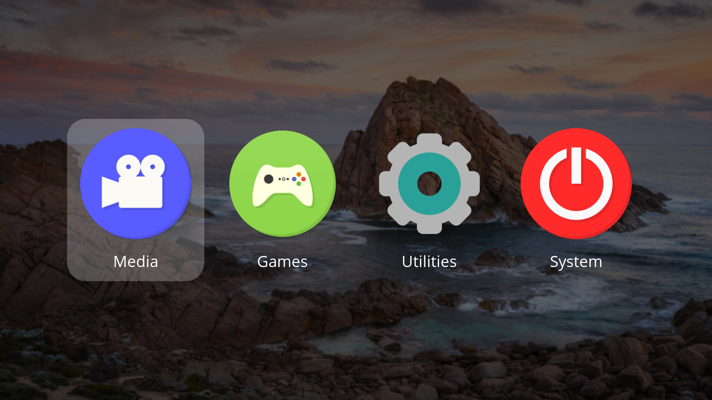
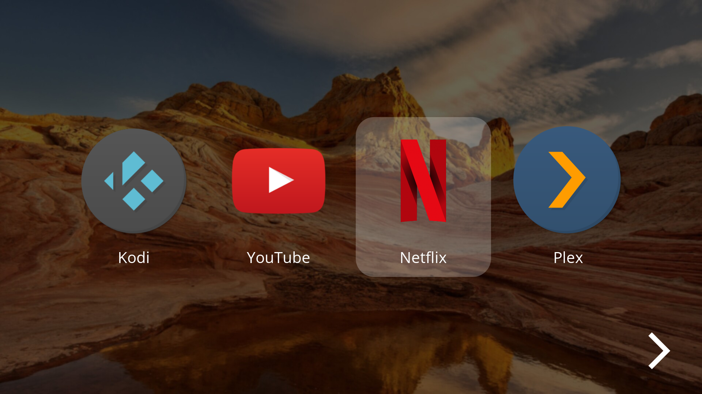

<div align="center">
  <a>
    
  </a>


# Flex Launcher
</div>
<details open>
  <summary>Table of Contents</summary>
  <ol>
    <li>
      <a href="#about">About</a>
    </li>
    <li>
      <a href="#screenshots">Screenshots</a>
    </li>
    <li>
      <a href="#installation">Installation</a>
      <ul>
        <li><a href="#windows">Windows</a></li>
        <li><a href="#linux">Linux</a></li>
      </ul>
    </li>
    <li><a href="#usage">Usage</a></li>
    <li><a href="#contributing">Contributing</a></li>
    <li><a href="#documentation">Documentation</a></li>
    <li><a href="#credits">Credits</a></li>
  </ol>
</details>

## About
Flex Launcher is a customizable application launcher designed with a [10 foot user interface](https://en.wikipedia.org/wiki/10-foot_user_interface). Its intended purpose is to simplify the control of a home theater or couch gaming PC by providing an interface that is similar to a TV set-top box or game console. Flex Launcher allows you to launch applications on your living room PC entirely by use of a TV remote or a gamepad. No keyboard or mouse required!

Flex Launcher is compatible with both Windows and Linux.

## Screenshots



## Installation
Compiled binaries are available for Windows 64 bit and Linux x86-64. Alternatively, you may also choose to compile the program yourself instead using the [compilation guide](extra/docs/compilation_guide.md).

### Windows
A win64 zip file is provided on the release page. Simply download the file and extract the contents to a directory of your choosing.

### Linux
Binary packages are available on the release page for APT and pacman based distributions. You may use the commands below to install.

#### APT-based Distributions (Debian, Ubuntu, Mint, etc.)
```
wget file
sudo apt install ./file
```

#### Pacman-based Distributions (Arch, Manjaro, etc.)
```
wget file
sudo pacman -U file
```
#### Copying Assets to Home Directory
The Linux packages install a default config file and assets to /usr/share/flex-launcher. It is strongly recommended to NOT edit this config file directly, as it will be overwritten if you upgrade to a later version. Instead, copy these files to your home directory and edit it there.
```
cp files
sed files
```

## Usage
Flex Launcher is used as follows:
```
flex-launcher -c /path/to/config.ini
```
If no config file is specified on the command line, the program will search for a file named ```config.ini``` in the following locations in order:
1. The current working directory
2. The directory containing the ```flex-launcher``` executable
3. Linux only: ~/.config/flex-launcher
4. Linux only: /usr/share/flex-launcher

If your config file is in one of the above locations, Flex Launcher can be started simply by double clicking the executable file or adding it to autostart without the need to pass arguments to it.

Flex Launcher ships with a default config file which is intended strictly for demonstation purposes. If you try to start one of the applications, it is possible that nothing will happen because the install path is different on your system, or you don't have the application installed at all. See the [configuration file documentation](extra/docs/configuration.md) for instuctions on how to change the menus and settings.

The keyboard arrow keys move the cursor left and right. Enter selects the current entry, backspace goes back to the previous menu (if applicable), and Esc quits the program. Flex Launcher does not feature built-in decoding of IR or CEC signals. If you plan to use a TV remote to control the device, it is assumed that these signals are decoded by the OS or another program and mapped to keyboard presses, which can then be received by Flex Launcher. Gamepad controls are built-in to the program and can be set in the configuration file.

## Contributing
Contributions are welcome for bugfixes and new features. Please keep code formatted to 2 space K&R style

## Documentation
Here is a list of available documentation:
- [Configuration File](extra/docs/configuration.md)
- [Compilation Guide](extra/docs/compilation_guide.md)

## Credits
Flex Launcher is made possible by the following projects:
- [SDL](https://github.com/libsdl-org/SDL), including the subprojects:
  - [SDL_image](https://github.com/libsdl-org/SDL_image)
  - [SDL_ttf](https://github.com/libsdl-org/SDL_ttf)
- [Nanosvg](https://github.com/memononen/nanosvg)
- [inih](https://github.com/benhoyt/inih)
- [Numix icons](https://github.com/numixproject)

The creation of Flex Launcher was inspired by the excellent desktop application launcher [xlunch](https://github.com/Tomas-M/xlunch).
